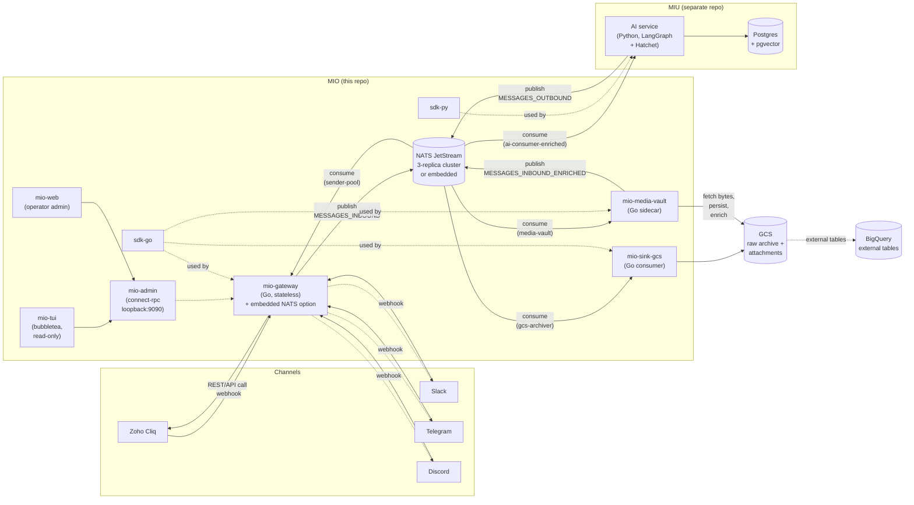
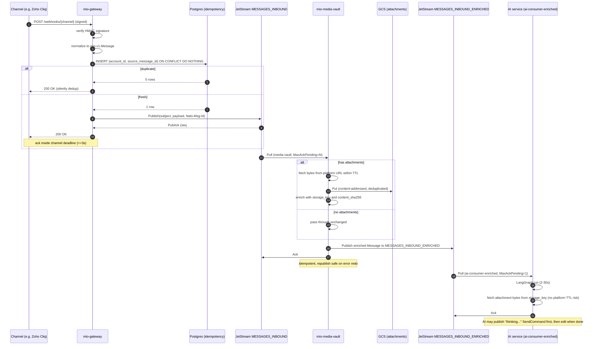
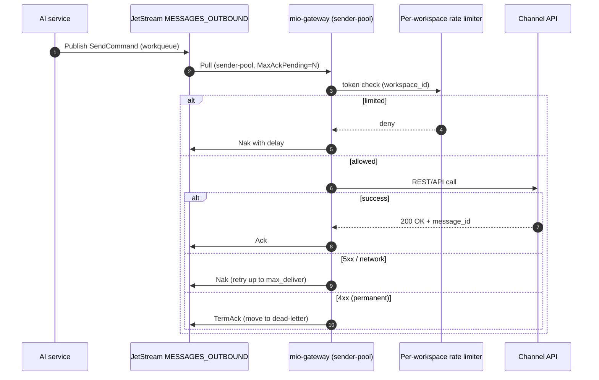
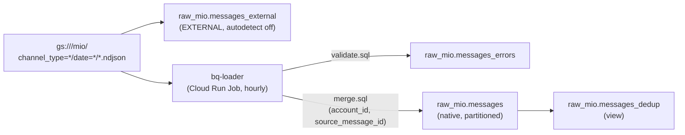
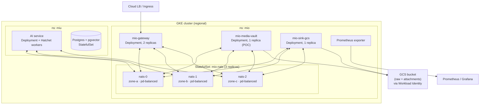

# MIO — System Architecture

> Status: design doc, locked-in for the POC. Last updated 2026-05-10 (P9 attachment-persistence shipped).

MIO is the messaging I/O platform for [MIU](https://github.com/vanducng/miu).
Channels are messy; agents shouldn't care. MIO normalizes every chat
surface (Zoho Cliq first, then Slack / Telegram / Discord / …) into one
canonical envelope so MIU's AI service receives a `Message` and returns
a `SendCommand` — without ever importing a channel SDK.

This document is the source of truth for **what MIO is**. The phased
build plan and morning journal live in `.work/plans/plan.md` (local-only).

---

## 1. Why decoupled

Every channel webhook has a hard ack deadline (Slack: 3s, Discord: 3s,
Cliq: ~5s). LLM calls take 2–30s. Coupling them drops messages on the
first slow agent run.

MIO sits in between: gateway acks fast, durably persists to a bus, AI
service consumes on its own schedule. Side benefits:

- **Replay** for prompt iteration and training-data harvest
- **Failure isolation** between transport and intelligence
- **Independent scaling** — gateway is bursty/CPU-light, AI is steady/CPU-heavy
- **New consumers for free** — analytics, archive, audit can subscribe without touching the receiver

---

## 2. Component map



Crucial: **the AI service is not in this repo.** MIO ships the SDKs and
guarantees the envelope; MIU imports `sdk-py` and lives elsewhere. This
is the boundary that keeps "intelligence" and "transport" separable.

---

## 3. Admin Control Plane & TUI

**mio-admin** (`cmd/admin`): Connect-RPC server (loopback:9090 by default, CIDR allowlist).

**RPCs:**
- `CreateTenant`, `ListTenants`, `GetTenant` — tenant lifecycle and lookup
- `ListChannelTypes` — registered channel adapters and capabilities
- `StartInstall`, `CompleteInstall` — operator-driven OAuth install dance
- `ListAccounts` — enumerate accounts per tenant
- `DisableAccount`, `RotateCredential` — existing write operations
- `TailMessages` — streaming tail of inbound messages (debugging)
- `install_stash` OAuth flow with `purgeExpired` ticker — clean up stale install state

**mio-tui** (`ui/tui`, bubbletea): Read-only v1 terminal client.
- Connects to admin server over HTTP (default `ADMIN_URL=http://127.0.0.1:9090`)
- Inspect messages, list channels, view consumer lag
- Write ops deferred to P6+

**mio-web** (`ui/web`): Internal read-only operator console with a Go BFF and
embedded React SPA. Local development can front a loopback admin server, but
cluster deploys must not rely on cross-pod loopback. The default cluster
topology is a non-public AdminService listener behind an internal ClusterIP,
with `MIO_ADMIN_ALLOW_CIDRS` and NetworkPolicy allowing only the web-admin pods
to dial `:9090`. Customer-facing workspace onboarding remains in MIU.

**Embedded NATS Option:** All-in-one binary (`cmd/all-in-one`) bundles gateway + NATS JetStream (memory or file-backed).
- Laptop demos, single-host POC, development
- Guard: panics on `MIO_ENV=prod` + `--storage memory`
- Production: always external 3-replica cluster

---

## 4. Inbound data flow

The hot path on receive. Every step has a clear owner.



Latency budget on the gateway path: **target p99 < 500ms**, hard ceiling
the channel deadline. Anything that doesn't fit (signature verify,
Postgres upsert, NATS publish) is moved off-path or pre-warmed.

---

## 5. Outbound data flow

The reply path. AI publishes a `SendCommand`; gateway delivers to the
channel and reports back.



Two-step UX rule: for any LLM run > 1s, the AI service emits a "thinking…"
`SendCommand` first, then an **edit** `SendCommand` referencing the same
`channel_message_id` once the real answer is ready. The user never sees
a blank thread.

---

## 6. Streams and subjects

Three streams, all file-backed, all `mio.v1` envelope.

| Stream | Subject pattern | Retention | Max age | Purpose |
|---|---|---|---|---|
| `MESSAGES_INBOUND` | `mio.inbound.>` | `limits` | 7d | Raw inbound. Gateway publisher. Attachment-downloader + sink-gcs consumers. (Old AI consumer deprecated.) |
| `MESSAGES_INBOUND_ENRICHED` | `mio.inbound_enriched.>` | `limits` | 7d | Enriched with persistent attachment URLs. Attachment-downloader publisher. AI consumer + future analytics subscribers. |
| `MESSAGES_OUTBOUND` | `mio.outbound.>` | `workqueue` | 23h | Drain semantics. Sender-pool is the only consumer. |

### Subject grammar

```
mio.<direction>.<channel_type>.<account_id>.<conversation_id>[.<message_id>]
        ▲              ▲             ▲              ▲                ▲
        │              │             │              │                └─ optional, for edit/delete commands
        │              │             │              └─ enables per-conversation ordering filters
        │              │             └─ per-account rate-limit / multi-tenant scoping (one tenant may run multiple accounts)
        │              └─ registry slug from proto/channels.yaml (zoho_cliq, slack, telegram, discord) — underscore for multi-word
        └─ inbound | inbound_enriched | outbound
```

Examples:

```
mio.inbound.zoho_cliq.<account-uuid>.<conv-uuid>
mio.inbound_enriched.zoho_cliq.<account-uuid>.<conv-uuid>
mio.outbound.slack.<account-uuid>.<conv-uuid>.<msg-uuid>
mio.outbound.zoho_cliq.<account-uuid>.<conv-uuid>.<msg-uuid>
```

Why these dimensions live in the subject:

| Dimension | Rationale |
|---|---|
| `direction` | One stream per direction; subject prefix lets a single filter scope a consumer cleanly. |
| `channel_type` | Per-channel sender pools, per-channel rate-limit buckets, per-channel sinks. Registry slug, not enum. |
| `account_id` | Per-account rate limits — one chatty workspace must not starve others; idempotency key with `source_message_id`. |
| `conversation_id` | Future-proofs partition-per-conversation when global `MaxAckPending=1` graduates (subject-shard). |

---

## 7. Consumer model

| Consumer | Stream | Type | `MaxAckPending` | Notes |
|---|---|---|---|---|
| `media-vault` | `MESSAGES_INBOUND` | Pull, durable | **N** | Fetches attachment bytes within platform TTL, persists to storage, publishes to enriched stream. Stateless; can scale horizontally. |
| `gcs-archiver` | `MESSAGES_INBOUND` | Pull, durable | 64 | Long-tail consumer; falls behind without affecting attachment or AI path. Archives raw inbound. |
| `ai-consumer-enriched` | `MESSAGES_INBOUND_ENRICHED` | Pull, durable | **1** | Single-flight. Per-thread ordering enforced globally for now; partition by subject when throughput demands. |
| `sender-pool` | `MESSAGES_OUTBOUND` | Pull, durable | **32** | Workqueue drain. One pool per channel adapter eventually. |

*Deprecated:* `ai-consumer` on `MESSAGES_INBOUND` — remove after successful
enriched-stream cutover via `nats consumer rm MESSAGES_INBOUND ai-consumer`.

Adding a new consumer (analytics, training-data tap, audit) is a config
change, not an engineering task. That's the *whole point* of the decoupled bus.

---

## 8. Idempotency, ordering, rate limits

### Idempotency

Two layers, defense in depth:

1. **NATS publish dedup** via `Nats-Msg-Id` header inside the stream's
   `duplicate_window` (2 min). Catches retries from the gateway itself.
2. **Postgres unique constraint** on `(account_id, source_message_id)`.
   Authoritative. Catches channel-level redeliveries past the dedup window.
   `account_id` (not `channel_type`) so one tenant running two installs of
   the same platform — e.g. two Slack workspaces — gets disjoint dedup keys.

The gateway's loop is: signature verify → upsert → publish → ack. If
the upsert returns "already exists," we silently 200 the channel and
skip the publish.

### Ordering

The bus does not order across subjects. We enforce ordering by:

- **Per-stream**: NATS gives FIFO within a stream
- **Per-conversation**: `MaxAckPending=1` on `ai-consumer-enriched` makes the
  consumer effectively single-flight. Slow but correct. (Attachment-downloader
  has `MaxAckPending > 1` since it batches fetches and has no AI latency.)
- **Graduation path**: once we need throughput, partition by subject —
  one consumer per `mio.inbound_enriched.<channel_type>.<account_id>.<conversation_id>`
  shard. Documented but not built

### Rate limits

Per-`account_id` token buckets (one bucket per channel install), sized
per channel API. Lives in the gateway sender-pool, not the bus. Adapters
may override the bucket key (e.g. Slack tier-4 uses
`account_id:conversation_external_id` for per-channel fairness). Examples:

| Channel | Limit | Source |
|---|---|---|
| Zoho Cliq | 10 msg/sec/bot | Cliq REST docs |
| Slack | 1 msg/sec/channel (chat.postMessage tier 4) | Slack rate-limit docs |
| Telegram | 30 msg/sec/bot global, 1/sec/chat | Telegram Bot API |
| Discord | 5 msg/5s/channel | Discord HTTP rate limits |

Burst is fine. The bucket refills; the workqueue retries on Nak.

---

## 9. Storage tiers

Two lifetimes, two access patterns, never shared.

| Tier | Tech | Lifetime | Access pattern | Owner |
|---|---|---|---|---|
| Operational | Postgres + pgvector | hot | per-thread, low-latency, transactional | MIU |
| Bus | NATS JetStream | 7d (in) / 23h (out) | streaming, replayable | MIO |
| Lake | GCS NDJSON | indefinite (lifecycle to Coldline) | append-only, batch | MIO (sink-gcs) |
| Warehouse | BigQuery `raw_mio` | indefinite (no partition expiry yet) | analytical, deduped | MIO (bq-loader) |

GCS partitioning: `gs://<your-mio-ndjson-bucket>/mio/channel_type=<slug>/date=YYYY-MM-DD/`
(Hive-style; `channel_type` is the `proto/channels.yaml` registry slug — e.g.
`zoho_cliq`, `slack`). Lifecycle: Standard → Nearline @ 30d → Coldline @ 90d.

### 8.1 BigQuery lakehouse (`raw_mio`)

GCS NDJSON is the lake-of-record. The `raw_mio` dataset hosts four objects
that materialise it for analyst use, populated by a job that lives **outside**
this repo (consumer-side concern; mio publishes the schema contract, downstream
deployers build the pipelines — a Cloud Run Job, Airflow DAG, or equivalent).
No streaming sink, no second writer.

| Object | Type | Purpose |
|---|---|---|
| `messages_external` | Hive-partitioned EXTERNAL TABLE | Ad-hoc / ops queries; duplicates present by design. |
| `messages` | Native, partitioned by `DATE(received_at)`, clustered on `(channel_type, account_id, conversation_id)` | Authoritative warehouse table. `require_partition_filter=TRUE`. |
| `messages_dedup` | View | Analyst-facing canonical query — unique on `(account_id, source_message_id)`. **Use this.** |
| `messages_errors` | Native, 30-day partition expiry | Quarantine for rows the loader couldn't validate. |



**SLA:** rows visible in `messages` within ~10–60 min of NDJSON write
(Cloud Scheduler `5 * * * *` + Cloud Run Job <5 min budget per window).

**Dedup recipe:** `messages_dedup` keeps the most-recent row per
`(account_id, source_message_id)` ordered by `(received_at DESC, _ingest_at DESC)`.
At-least-once delivery from sink-gcs means duplicates exist in the lake;
they are resolved at read time, not at write time.

**Schema-evolution rule:** proto change → DDL change in the same PR.
`services/sink-gcs/sql/check-proto-drift.sh` (foundation guard, runs in mio CI)
fails the PR if proto fields outpace `services/sink-gcs/sql/messages_schema.json`.
Consumers vendor the schema and verify it against mio main in their own CI.

**Wire format:** sink-gcs emits snake_case NDJSON (`UseProtoNames: true`)
so keys match the BQ schema 1:1 — flipping back silently NULLs columns.

**Retention:** no partition expiration on `messages` yet; revisit when org
retention policy lands. `messages_errors` carries 30-day expiry.

**PII:** `text` and `sender.display_name` carry user content; access today
matches the existing `raw_*` dataset policy (no column-level security).
Revisit if PII concerns escalate.

**Reference:** `services/sink-gcs/sql/README.md` (DDL + schema contract);
loader implementation lives in the deployer's own infra repo.

---

## 10. Deployment topology

POC target: GKE.



Stack rules carried over:

- Helm charts in-repo under `deploy/charts/{mio-nats,mio-gateway,mio-sink-gcs}`
- Only K8s primitives — no Cloud Pub/Sub, no Cloud Run; cloud-agnostic by construction
- Workload Identity for GCS auth; no service-account JSON files
- Single regional cluster for POC; multi-region is future work

---

## 11. Observability

Everything emits OpenTelemetry traces and Prometheus metrics. Logs are
structured JSON via `slog` (Go) and `structlog` (Python).

### Trace correlation

Trace context propagates: channel webhook → gateway → bus header
(`mio-trace-id`) → AI consumer → outbound publish → sender pool →
channel API. A single user message produces one root trace covering
the whole loop.

### Key metrics

Label discipline (cross-phase invariant): the only allowed application-metric
labels are `channel_type`, `direction`, `outcome`. Adding `account_id`,
`tenant_id`, `conversation_id`, `message_id`, or any free-form string is
forbidden — they are cardinality bombs. Phase-specific bounded extras
(`http_status` bucketed `2xx/4xx/429/5xx/network`, `reason` bounded enum)
are acceptable; see P5.

| Metric | Owner | Why |
|---|---|---|
| `mio_gateway_inbound_latency_seconds{channel_type,direction,outcome}` | gateway | p99 < 500ms SLO |
| `mio_gateway_outbound_send_total{channel_type,direction,outcome}` | gateway | rate-limit hits, channel errors |
| `mio_jetstream_consumer_lag{stream,consumer}` | NATS exporter | AI consumer falling behind |
| `mio_sink_gcs_bytes_written_total{channel_type}` | sink-gcs | archive throughput |
| `mio_idempotency_dedup_total{channel_type}` | gateway | redelivery rate sanity |

---

## 12. Non-goals (explicit)

- **No customer UI in MIO.** Internal operator UI is in scope under `ui/`; customer-facing workspace onboarding lives in MIU.
- **No staging cluster.** Solo dev scale; feature flags + fast rollback.
- **No multiple channel adapters on day one.** Cliq POC first, generalize after.
- **No AI agent code in this repo.** Agents live in MIU.
- **No dedicated BigQuery sink.** GCS + external tables.
- **No managed cloud bus.** NATS JetStream — cloud-agnostic by construction.

---

## 13. Open questions

- Per-thread ordering on enriched stream: stay global `MaxAckPending=1` or shard-by-subject? Decide when first throughput regression appears. (Attachment-downloader's `MaxAckPending > 1` doesn't need ordering guarantees.)
- Edit semantics across channels: Slack and Cliq both support edits with the original `channel_message_id`; Telegram supports `edit_message_text`; Discord requires the original message be from the same bot. The `SendCommand.edit_of` field needs a per-channel resolver — design at P5, not now.
- Dead-letter strategy: separate `MESSAGES_DLQ` stream vs in-place `terminated` flag? Defer until we hit a real channel-permanent failure in the wild.
- Attachment backend portability: S3, Azure Blob, Backblaze B2? Factory pattern ready; plug in a new Storage impl. Defer multi-backend support until operational need arises.
